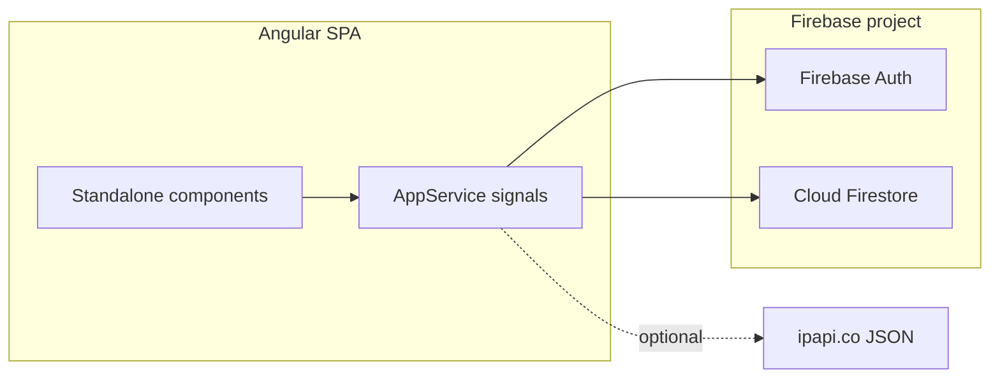

# Mathozz 🧮
**Think fast. Go further.**

A production-ready mental math PWA built with Angular 21, Firebase, and raw Web APIs. No UI libraries. No AngularFire. Pure signals.

---

## Guide for AI coding agents

Use this section to orient quickly before editing code. Prefer **small, focused changes**; match existing patterns (standalone components, signals, `AppService` as the single state hub).

### Architecture

| Piece | Role |
|--------|------|
| `AppComponent` | Root shell: theme host class, `<router-outlet />`, and **one-time patches** on `AppService.loginWithGoogle` / `loginWithEmail` / `signupWithEmail` to navigate to `/dashboard` after successful auth. |
| `AppService` | **All shared state** (signals): auth user, game session, guest progress, leaderboard fetch, theme, `currentScreen` for game/result/home overlays used by play logic, `userStatsReady` for dashboard stats hydration, etc. Firebase Auth + Firestore via modular SDK in `app.config.ts` exports. |
| Routed pages | `DashboardComponent`, `ProfileComponent`, `PlayComponent`, `LoginComponent`, `ReportsComponent` — each standalone, most logic delegated to `AppService`. |
| Styles | Global UI in `app.scss` (imported by `AppComponent`, `ViewEncapsulation.None`). |

### Routes (`app.config.ts`)

| Path | Component | Notes |
|------|------------|--------|
| `''` | → redirect `dashboard` | |
| `dashboard` | `DashboardComponent` | Signed-in stats; guest banner. |
| `profile` | `ProfileComponent` | |
| `play` | `PlayComponent` | Game UI; starts a game on init if `currentScreen` is not `game`. |
| `login` | `LoginComponent` | Full-screen auth; sets `currentScreen` to `'login'` on init. |
| `admin-reports-secret-2024` | `ReportsComponent` | Admin. |
| `**` | → `dashboard` | |

### Auth and data loading

- **Guest** is modeled as `AppService.user() === null` (`isGuest` computed).
- On Firebase login, `onUserLogin` merges Firestore user doc + local guest progress; **`userStatsReady`** gates dashboard stat numbers until the Firestore read completes (writes to Firestore must not block showing merged stats).
- **Guest limit (50 problems):** service navigates to `/login` via `Router` when the limit hits.

### Game / play behavior

- **`currentScreen`:** `'game'` while playing; `'result'` exists in the type and `AppService.endGame()` but **play UI no longer shows a result screen** — stopping the game clears saved state, sets screen to `'home'`, and **navigates to `/dashboard`**.
- Pause + “go home” saves in-progress state to `localStorage` for resume.

### Firebase

- Collections, fields, auth flow, and SDK call map: see **Low-Level Design** and **§ Firestore Collections Reference** below.
- Deploy: `firebase deploy` (hosting build output `dist/mathozz/browser` per `firebase.json`).

### Commands

```bash
npm install
npm start          # ng serve → http://localhost:4200
npm run build      # production build
npm test           # unit tests (Vitest-powered where configured)
```

### Conventions to preserve

- **Standalone** components; **zoneless** change detection (`provideZonelessChangeDetection`).
- State in **`signal` / `computed`** on `AppService`, not scattered duplicated state.
- **No AngularFire** — use `firebase/auth` and `firebase/firestore` directly.
- Do not add heavy UI frameworks; keep SCSS + CSS variables consistent with `app.scss`.

---

## Tech Stack

| Layer | Choice |
|---|---|
| Framework | Angular 21 (standalone, zoneless) |
| State | Angular Signals only |
| Auth + DB | Firebase Modular SDK v12+ (no compat, no AngularFire) |
| Styles | Inline SCSS + CSS variables |
| Audio | Web Audio API (no library) |
| Confetti | Canvas API (no library) |
| PWA | @angular/pwa |

---

## Low-Level Design

This section describes how the app is structured at implementation level: pages, features, where network I/O happens, and how Firebase fits in. There is **no custom REST backend** in this repo; all persistent data goes through the **Firebase Web SDK** (HTTPS to Google). The only non-Firebase HTTP call is **geolocation** via a public IP API.

### System context



### Pages and routing

| Path | Component | Role |
|------|-----------|------|
| `''` | *(redirect)* | → `dashboard` |
| `dashboard` | `DashboardComponent` | Home: hero, guest progress / signed-in stats, resume saved game, nav to play or login |
| `profile` | `ProfileComponent` | Signed-in user card, stats, badges display, feedback modal, sign out |
| `play` | `PlayComponent` | Active game UI: timer, numpad, pause/save, end game → dashboard, PWA install, feedback |
| `login` | `LoginComponent` | Google + email/password sign-in and sign-up; guest gate message when limit hit |
| `admin-reports-secret-2024` | `ReportsComponent` | Admin-style list of `problem-reports` (search, filter, mark resolved) |
| `**` | *(redirect)* | → `dashboard` |

**Root shell:** `AppComponent` hosts `<router-outlet />`, theme class on host, and patches `AppService` auth methods to navigate to `/dashboard` after successful login.

### Core modules and responsibilities

| Unit | Responsibility |
|------|----------------|
| `AppService` | Single state hub: auth user (`UserData`), game session signals, guest/localStorage, leaderboard fetch, theme, geo fields, Firestore read/write helpers, feedback/problem-report writes |
| `app.config.ts` | `provideZonelessChangeDetection`, `provideRouter`, `provideServiceWorker`; **Firebase bootstrap**: `initializeApp(environment.firebase)`, `getAuth`, `getFirestore` — exported as `firebaseApp`, `firebaseAuth`, `firebaseDb` |
| `PwaInstallService` | Prompt / detect installability for the PWA (used from play screen) |
| `environment*.ts` | Firebase web config (`apiKey`, `authDomain`, `projectId`, etc.) |

### Feature inventory

| Feature | Where it lives | Persistence |
|---------|----------------|-------------|
| Mental math session (problems, streak, XP, timer, pause) | `AppService` + `PlayComponent` | Signed-in: Firestore `users` + `leaderboard`; guest: `localStorage` key `mathozz_guest` |
| Saved game (pause/resume) | `AppService` | `localStorage` `mathozz_saved_game` |
| Dark / light theme | `AppService` | `localStorage` `mathozz_theme` |
| Leaderboard (global / country / city) | `AppService.fetchLeaderboard`, UI from dashboard/profile flows | Firestore `leaderboard` collection; scope uses `userCountry` / `userCity` from ip lookup |
| Auth (Google, email) | `AppService` + `LoginComponent` | Firebase Auth; user profile doc in Firestore |
| Feedback form | `AppService.submitFeedback` | Firestore `problem-reports` with `type: 'user-feedback'` |
| Problem / bug reports | `AppService.submitProblemReport`, `getProblemReports`, `markReportResolved` | Firestore `problem-reports` |
| Admin reports UI | `ReportsComponent` | Reads/updates Firestore via `AppService` |

### Authentication (low level)

1. **`onAuthStateChanged(firebaseAuth, …)`** in `AppService` constructor drives session lifecycle.
2. **Signed in:** `userStatsReady` → false; optimistic `user` from `mergeUserData(fb, guest, null)`; then **`getDoc(users/{uid})`**; merge with guest progress; **`userStatsReady` → true**; async **`setDoc`** user + **`updateLeaderboardEntry`** (must not block showing merged stats).
3. **Signed out:** `user` → null, `userStatsReady` → true.
4. **Methods:** `signInWithPopup` + `GoogleAuthProvider`, `signInWithEmailAndPassword`, `createUserWithEmailAndPassword` + `updateProfile`, `signOut`.
5. **Guest** = no Firebase user (`user() === null`); after 50 solved problems, app navigates to `/login`.

### Firestore — collections and SDK usage

| Collection | Document ID | Purpose |
|------------|-------------|---------|
| `users` | Firebase `uid` | Profile + aggregate stats (accuracy, XP, streaks, geo, badges array, etc.) |
| `leaderboard` | Firebase `uid` | Denormalized row for ranking (XP, level, accuracy, geo, etc.) |
| `problem-reports` | Auto-generated | User feedback, bug reports, optional game snapshot |

**Operations map (conceptual “API” — all via modular `firebase/firestore`):**

| Operation | When | Functions used |
|-----------|------|----------------|
| Read user | After login | `getDoc(doc(db, 'users', uid))` |
| Upsert user | After login merge, initial save | `setDoc(..., { merge: true })` with `serverTimestamp()` |
| Patch user stats | After each answered problem (signed-in only) | `updateDoc` on `users/{uid}` |
| Upsert leaderboard row | After login and after each stat persist | `setDoc` on `leaderboard/{uid}`, merge |
| Query leaderboard | User opens leaderboard / changes scope | `query` + `where` + `orderBy('xp','desc')` + `limit(50)` — **composite indexes** required for country/city (see `firestore.indexes.json`) |
| Create report / feedback | User submits | `setDoc` on new doc in `problem-reports` |
| List reports (admin) | Reports page | `query` + `orderBy('timestamp','desc')` + `limit(100)` |
| Mark resolved | Admin action | `updateDoc` on report doc |

**Security rules** (`firestore.rules`): owner-only `users/{userId}`; authenticated read + owner write on `leaderboard/{userId}`; `problem-reports` allows open create and (currently) open read/update for admin testing — tighten for production.

### External HTTP (non-Firebase)

| URL | Method | Used for |
|-----|--------|----------|
| `https://ipapi.co/json/` | GET | Country/city for leaderboard scopes (`detectLocation` in `AppService`) |

### “Endpoints” and hosting

- The app does **not** define Express/Cloud Functions routes in this repo.
- **Firebase Hosting** (`firebase.json`) serves `dist/mathozz/browser`, with **`**` → `/index.html`** for SPA routing. Security headers are set for all paths.
- **Firestore** and **Auth** are reached through the Firebase client SDK (not manually documented REST paths).

### Integration checklist (Firebase)

| Concern | Location |
|---------|----------|
| Web config | `src/environments/environment.ts` (+ prod) |
| App init | `initializeApp` in `app.config.ts` |
| Auth + Firestore singletons | `firebaseAuth`, `firebaseDb` exported from `app.config.ts`, imported in `AppService` |
| Rules + indexes | `firestore.rules`, `firestore.indexes.json` |
| Deploy | `firebase deploy` (hosting + `firestore` as configured) |

---

## Project Structure

```
mathozz/
├── src/
│   ├── app/
│   │   ├── app.component.ts      ← Root shell, router-outlet, auth navigation patches
│   │   ├── app.service.ts        ← Signals, Firebase, game logic
│   │   ├── app.config.ts         ← Firebase init, `provideRouter`, SW
│   │   ├── app.scss              ← Global styles
│   │   ├── dashboard.component.ts
│   │   ├── profile.component.ts
│   │   ├── play.component.ts
│   │   ├── login.component.ts
│   │   ├── reports.component.ts
│   │   └── pwa-install.service.ts
│   ├── environments/
│   │   ├── environment.ts
│   │   └── environment.prod.ts
│   └── main.ts
├── firestore.rules
├── firestore.indexes.json
├── firebase.json
└── package.json
```

---

## 1. Firebase Console Setup

### Create a Project
1. Go to [https://console.firebase.google.com](https://console.firebase.google.com)
2. Click **Add project** → name it `mathozz` → Continue
3. Disable or enable Google Analytics (your choice) → Create project

### Register a Web App
1. In the project overview, click the **</>** (Web) icon
2. Name it `mathozz-web` → Register app
3. Copy the `firebaseConfig` object — you'll need it below

### Enable Authentication
1. Go to **Build → Authentication → Get started**
2. Click **Sign-in method** tab
3. Enable **Google** → set your support email → Save
4. Enable **Email/Password** → Save

### Enable Firestore
1. Go to **Build → Firestore Database → Create database**
2. Start in **production mode**
3. Choose a region close to your users (e.g. `us-central`, `europe-west`)
4. Click Done

### Deploy Firestore Rules & Indexes
After setting up Firebase CLI (see step 4), run:
```bash
firebase deploy --only firestore
```

---

## 2. Replace Environment Keys

Open `src/environments/environment.ts` and `environment.prod.ts`, replace every `REPLACE_ME` with your actual Firebase config values:

```typescript
export const environment = {
  production: false,
  firebase: {
    apiKey: 'AIzaSy...',
    authDomain: 'your-project.firebaseapp.com',
    projectId: 'your-project-id',
    storageBucket: 'your-project.appspot.com',
    messagingSenderId: '123456789',
    appId: '1:123456789:web:abc123'
  }
};
```

**Never commit real keys to a public repo.** Use environment variables or Firebase App Check in production.

---

## 3. Local Development

```bash
npm install
npm start
# → http://localhost:4200  (same as `ng serve`)
```

---

## 4. Firebase CLI Setup

```bash
# Install Firebase CLI
npm install -g firebase-tools

# Login
firebase login

# Initialize Firebase in your project root
firebase init

# Select:
#   ◉ Firestore
#   ◉ Hosting
# Use existing project → select your mathozz project
# Hosting public dir: dist/mathozz/browser
# Single-page app: Yes
# Auto-deploy with GitHub: Optional
```

---

## 5. Deploy to Production

```bash
# Build
ng build --configuration production

# Deploy everything (hosting + firestore rules + indexes)
firebase deploy

# Or deploy individually
firebase deploy --only hosting
firebase deploy --only firestore
```

Your app will be live at `https://your-project-id.web.app`.

---

## 6. Firestore Collections Reference

### `users/{userId}`
```
displayName: string
email: string
photoURL: string
totalSolved: number
totalCorrect: number
accuracy: number          // 0–100
currentStreak: number
bestStreak: number
topSession: number       // best "correct in one game" session
dailyStreak: number
lastPlayedDate: string    // ISO date "YYYY-MM-DD"
xp: number
level: number
averageResponseMs: number
country: string
city: string
isPremium: boolean        // always false for now
badges: string[]
createdAt: Timestamp
updatedAt: Timestamp
```

### `leaderboard/{userId}`
```
displayName: string
xp: number
level: number
accuracy: number
bestStreak: number
topSession: number
averageResponseMs: number
country: string
city: string
updatedAt: Timestamp
```

### `problem-reports/{reportId}`
```
// Bug reports and user feedback share this collection.
// Feedback docs include type: 'user-feedback' plus optional email/phone.
userId, userEmail, userAgent, description, timestamp, resolved, screen
// Optional gameState when reported from play screen
```

---

## 7. Game Rules

Difficulty is driven by **current streak** in code (`AppService.difficulty`):

| Difficulty | Streak range | Operand ranges (see `buildProblem`) | Base XP (before speed + streak bonuses) |
|---|---|---|---|
| Easy | 0–7 | e.g. +/− up to ~20; × small; ÷ clean integers | 10 |
| Medium | 8–19 | larger operands | 20 |
| Hard | 20+ | largest operands | 35 |

Per-answer XP uses `calcXP(difficulty, responseMs, streak)` (speed factor and streak bonus — not a flat +10/+20/+35).

- **Wrong answer**: streak resets to 0; no XP for that problem
- **Time up (15s)** with input: wrong, streak reset, counts as attempt
- **Time up with no input**: counted as skip (`sessionSkipped`), does not reset streak
- **Guest mode**: 50 free problems, then navigate to `/login`
- **Guest data** merges into Firestore on first successful login

---

## 8. Badges

| Badge ID | Emoji | Condition |
|---|---|---|
| `first_blood` | 🩸 | First correct answer ever |
| `streak_10` | 🔥 | Reach streak of 10 |
| `streak_25` | ⚡ | Reach streak of 25 |
| `speed_demon` | ⚡ | Answer in under 3 seconds |
| `century` | 💯 | 100 total problems solved |

---

## 9. Keyboard Shortcuts

| Key | Action |
|---|---|
| `0–9` | Type answer digits (play screen) |
| `Enter` | Submit answer |
| `Backspace` | Delete last digit |
| `Space` | Pause / resume (play screen) |
| `Escape` | On **play**: pause and go to dashboard (saved game). On **login**: go to dashboard. |

---

## 10. PWA

The app includes `@angular/pwa` for offline support. After deploying, users can install it from their browser as a standalone app. The service worker caches app shell assets automatically.

---

## License

MIT — build something great.
